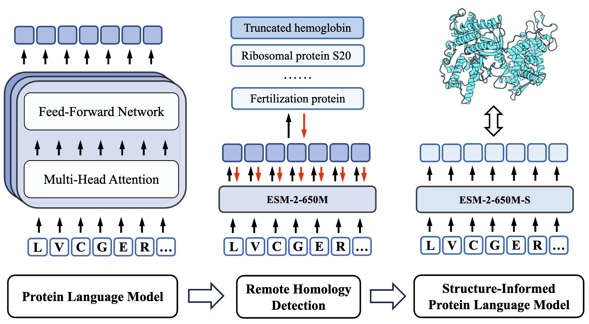

# Structure-Informed Protein Language Model

This is the official codebase of the paper

**Structure-Informed Protein Language Model** 
[[ArXiv](https://arxiv.org/abs/2402.05856)]

[Zuobai Zhang](https://oxer11.github.io/), [Jiarui Lu](https://lujiarui.github.io/), [Vijil Chenthamarakshan](https://researcher.watson.ibm.com/researcher/view.php?person=us-ecvijil), [Aurelie Lozano](https://researcher.watson.ibm.com/researcher/view.php?person=us-aclozano), [Payel Das](https://researcher.watson.ibm.com/researcher/view.php?person=us-daspa), [Jian Tang](https://jian-tang.com/)


## Overview

Protein language models are a powerful tool for learning protein representations. However, traditional protein language models lack explicit structural supervision. Recent studies have developed models that combine large-scale pre-training on protein sequences with the integration of structural information as input, *e.g.*, [ESM-GearNet](https://arxiv.org/abs/2303.06275). However, their reliance on protein structures as input limits their application to proteins without structures.

To address this issue, in this work, we introduce the integration of remote homology detection to **distill structural information into protein language models
without requiring explicit protein structures as input**.



We take the [ESM](https://github.com/facebookresearch/esm) models as example and train them on remote homology detection tasks, *a.k.a.*, fold classification.
The model weights for structure-informed ESM, *i.e.*, ESM-S, can be found [here](https://huggingface.co/Oxer11/ESM-S).

## Installation

You may install the dependencies via either conda or pip. Generally, ESM-S works
with Python 3.7/3.8 and PyTorch version >= 1.12.0.
Please make sure the latest version of torchdrug is installed.

### From Conda

```bash
conda install torchdrug pytorch=1.12.1 cudatoolkit=11.6 -c milagraph -c pytorch-lts -c pyg -c conda-forge
conda install easydict pyyaml -c conda-forge
```

### From Pip

```bash
pip install torch==1.12.1+cu116 -f https://download.pytorch.org/whl/lts/1.12/torch_lts.html
pip install torchdrug
pip install easydict pyyaml
```

## Reproduction

### Download Datasets and Model Weights

Define the environment variable `DATADIR` and `MODELDIR` and then download datasets and model weights into the corresponding directories.
The datasets and model weights can be downloaded from [Oxer11/ESM-S](https://huggingface.co/Oxer11/ESM-S) and [Oxer11/Protein-Function-Annotation](https://huggingface.co/datasets/Oxer11/Protein-Function-Annotation).
For all other datasets besides EC, GO and Fold, they will be downloaded automatically by TorchDrug during first loading.

```bash
DATADIR=./data
MODELDIR=./model

mkdir $DATADIR
cd $DATADIR
# Download remote homology detection dataset
wget https://huggingface.co/datasets/Oxer11/Protein-Function-Annotation/resolve/main/fold.tar.gz
tar -xvf fold.tar.gz
# Download Enyzme Commission dataset
wget https://huggingface.co/datasets/Oxer11/Protein-Function-Annotation/resolve/main/ec.tar.gz
tar -xvf ec.tar.gz
# Download Gene Ontology dataset
wget https://huggingface.co/datasets/Oxer11/Protein-Function-Annotation/resolve/main/ec.tar.gz
tar -xvf ec.tar.gz

cd ..
mkdir $MODELDIR
cd $MODELDIR
# Download ESM-2-650M model weight
wget https://dl.fbaipublicfiles.com/fair-esm/models/esm2_t33_650M_UR50D.pt
# Download ESM-2-650M-S model weight
wget https://huggingface.co/Oxer11/ESM-S/resolve/main/esm_650m_s.pth
```

### Load Trained Model Weight
Here we show how to load the structure-informed PLM weights `esm_650m_s.pth` into the `torchdrug.models.EvolutionaryScaleModeling` module.
By default, the model weights are saved as state dict.
```python
import torch
from torchdrug import models

model_dir = "./model"   # Set the path to your model dir
esm = models.EvolutionaryScaleModeling(model_dir, model="ESM-2-650M", readout="mean")

# Load ESM-2-650M-S
model_dict = torch.load(os.path.join(model_dir, "esm_650m_s.pth"), map_location=torch.device("cpu"))
esm.load_state_dict(model_dict)
```

### Structure-Informed Training

To reproduce the training of structure-informed protein language models, we need to train a base protein language model on the remote homology detection task, *i.e.*, fold classification.
You may choose to run on 4 gpus by reseting the `gpus` parameter in configure files. 

```bash
# Train ESM-2-650M on the fold classification dataset
python script/run.py -c config/esm_fold.yaml --datadir $DATADIR/fold --modeldir $MODELDIR --model ESM-2-650M

# Train ESM-2-650M with 4 gpus
# Remember to change the gpu in the config file to [0, 1, 2, 3]
python -m torch.distributed.launch --nproc_per_node=4 script/run.py -c config/esm_fold.yaml --datadir $DATADIR/fold --modeldir $MODELDIR --model ESM-2-650M
```

### Predictor-Based Methods

To test the effect of structure-informed training, we compare the results by feeding ESM and ESM-S's representations into a 2-layer MLP predictor.
The 2-layer MLP is fine-tuned on downtream function prediction datasets.

```bash
# Tune a 2-layer MLP on ESM's representations on EC
python script/run.py -c config/predictor/esm_ec.yaml --datadir $DATADIR/ec --modeldir $MODELDIR --model ESM-2-650M --ckpt null

# Tune a 2-layer MLP on ESM-S's representations on EC
python script/run.py -c config/predictor/esm_ec.yaml --datadir $DATADIR/ec --modeldir $MODELDIR --model ESM-2-650M --ckpt $MODELDIR/esm_650m_s.pth

# Tune a 2-layer MLP on ESM-S's representations on GO-BP
python script/run.py -c config/predictor/esm_go.yaml --datadir $DATADIR/go --level bp --modeldir $MODELDIR --model ESM-2-650M --ckpt $MODELDIR/esm_650m_s.pth

# Tune a 2-layer MLP on ESM-S's representations on Beta Lacatamase
# The dataset will be downloaded automatcially.
python script/run.py -c config/predictor/esm_beta.yaml --datadir $DATADIR/ --modeldir $MODELDIR --model ESM-2-650M --ckpt $MODELDIR/esm_650m_s.pth
```

You can also change the model `ESM-2-650M` to other sizes of ESM models.
```bash
# Tune a 2-layer MLP on ESM-2-150M-S's representations on EC
# Remember to download the esm_150_s.pth from the link above
python script/run.py -c config/predictor/esm_ec.yaml --datadir $DATADIR/ec --modeldir $MODELDIR --model ESM-2-150M --ckpt $MODELDIR/esm_150m_s.pth
```

After fine-tuning, you are expected to obtain the following results.


### Retriever-Based Methods
Besides predictor-based methods, we also use ESM and ESM-2's representations as a measure for measuring protein similarity.
Based on these similarities, we can annotate function labels for proteins in the test set.

```bash
# Run retriever with ESM's representations on EC
python script/retrieve.py -c config/retriever/esm_ec.yaml --datadir $DATADIR/ec --modeldir $MODELDIR --model ESM-2-650M --ckpt $MODELDIR/esm_650m_s.pth

# Run retriever with ESM-S's representations on GO-BP
python script/retrieve.py -c config/retriever/esm_go.yaml --datadir $DATADIR/go --level bp --modeldir $MODELDIR --model ESM-2-650M --ckpt $MODELDIR/esm_650m_s.pth

# Run retriever with ESM-S's representations on GO-MF
python script/retrieve.py -c config/retriever/esm_go.yaml --datadir $DATADIR/go --level mf --modeldir $MODELDIR --model ESM-2-650M --ckpt $MODELDIR/esm_650m_s.pth

# Run retriever with ESM-S's representations on GO-CC
python script/retrieve.py -c config/retriever/esm_go.yaml --datadir $DATADIR/go --level cc --modeldir $MODELDIR --model ESM-2-650M --ckpt $MODELDIR/esm_650m_s.pth
```

You are expected to obtain the following results.


## Citation
If you find this codebase useful in your research, please cite the following paper.

```bibtex
@article{zhang2024structureplm,
  title={Structure-Informed Protein Language Model},
  author={Zhang, Zuobai and Lu, Jiarui and Chenthamarakshan, Vijil and Lozano, Aurelie and Das, Payel and Tang, Jian},
  journal={arXiv preprint arXiv:2402.05856},
  year={2024}
}
```
